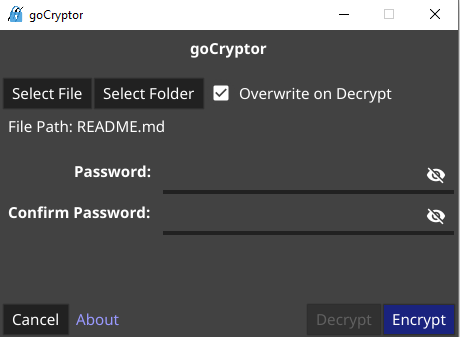

# goCryptor

goCryptor is a basic file encryption software for simple and quick encryption of files.  You can either select an individual file to encrypt or select a folder and all the files within will be encrypted.

goCryptor launches with a simple gui with a file/folder picker and a password entry.  You can launch it from the command line as well if you want, either with no arguments or see -h for the help.

With the windows installer you can encrypt and decrypt using goCryptor via the context menu for files and folders.

goCryptor uses AES-GCM encryption.

The encrypted file has the extension of ."ext".gcx, where ext is the original extension of the file.  However if the original extension is lost during a rename or other operation, the original extension is stored in the encrypted file and the decrypted file will have the original extension.
